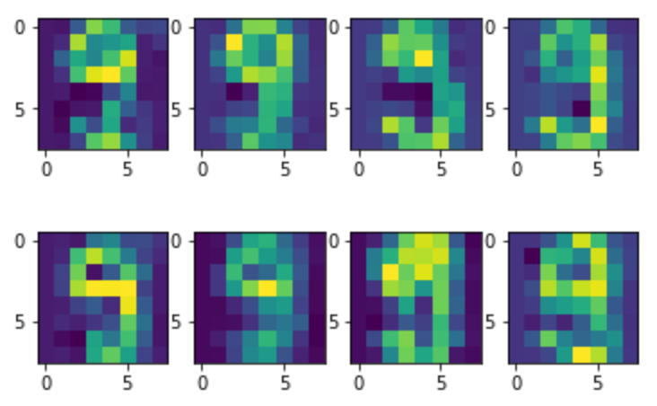

# Machine Learning

Kevin Siswandi  
https://github.com/Physicist91/ml-notes  

-------

This is my collection of notes (in Jupyter Notebooks) for the fundamentals of machine learning.

**Thumbnail**: the number "9" as generated by a QDA algorithm.

-------

TABLE OF CONTENTS:  
1. Dimensionality Reduction  
2. Classification  
3. Clustering  
4. Decision Tree  
5. Random Forest  
7. Linear Regression  
8. Ridge Regression and LASSO